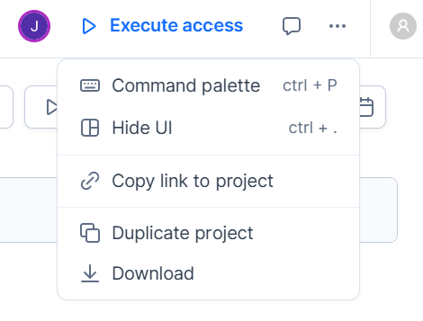
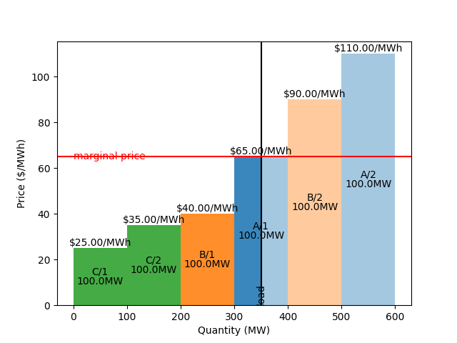
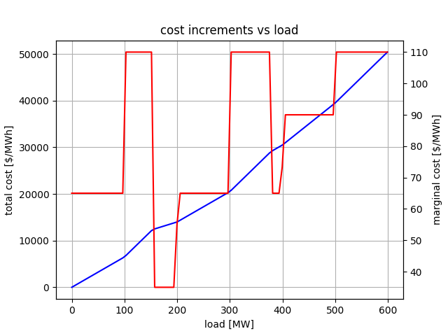

ARROW SEA 2025: Grid integration session
========================================

<!-- header: 'Intro & environment' -->

# Overview

1. Marginal pricing
2. Optimal power flow formulation
3. Congestion scenarios
4. Unit commitment

---

# Jupyter/Python notebook environment 

## Duplicate the ARROW SEA project in Deepnote

* Visit https://tinyurl.com/sea2025-deepnote
* Click on three dots `...` in the top-right corner
* Select `Duplicate project`
* Log in / Follow the prompts to create an account
* You can now edit a private copy of the project

---

<!-- header: '1. Marginal prices' -->

# Marginal prices 

## Objectives

Work through notebook `part1_mp` to:

* Review the graphical method of marginal pricing
* Reproduce this solution via linear programming

---

## (1a) Graphical approach to marginal pricing

1. Stack quantity-price offers pairs, ordered by price
2. Dispatch quantities to left of load
3. Intercept of load and offer price sets marginal price

> Does not apply to networks with limited transmission capacity

---

## (1b) Linear programming solution

* Study the [CVXPY](https://www.cvxpy.org/) formulation provided:
  1. Decision variables
  2. Constraints: bower balance, bounds
  3. Objective function
* Verify that we reproduce the graphical solution

---

### (Linearized/DC) OPF problem

Run every 5 minutes to clear the Real-Time Energy Market:

| Category  | Description                      | Per       | Unit      | New?    |
| --------- | -------------------------------- | --------- | --------- |-------- |
| output    | dispatch instructions            | generator | MW        |         |
| output    | locational marginal prices (LMP) | bus       | $/MWh     | per bus |
| input     | demands/loads                    | bus       | MW        | per bus |
| input     | (quantity, price) pairs          | offer     | (MW, $/MWh) |       |
| input     | (reactance, capacity) pairs      | line      | Ω, MW       | 🗸     |
| input     | line-bus connectivity            | -         | -           | 🗸     |

---

$$
\begin{aligned}
\text{total cost} = \min_{p, ~ f, ~ \theta} ~ {}& \sum_o c_o p_o \quad\text{sum over offers/buses}
\\
f_{bc} = {}& (\theta_a - \theta_b) / x_{bc} \quad \text{(power flow on line $bc$)}
\\
p_b = {}& \sum_{c} f_{bc} \quad \text{(power balance at bus $b$)}
\\
\vert f_{bc}\vert \leq {}& \bar{f}_{bc} \quad \text{(line capacity)}
\\
0 \leq p_a \leq {}& \bar{p}_b \quad \text{(injection bounds)}
\\
\theta_0 = {}& 0 \quad \text{angle at reference bus}
\end{aligned}
$$
Associated marginal price at bus $b$:
$$
\begin{aligned}
\text{LMP}_b~[\$/\text{MWh}] = \frac{\partial~\text{total cost [\$/h]}}{\partial~\text{load}_b~[\text{MW}]}
\end{aligned}
$$

---

### AC optimal power flow (OPF) problem

The linearized OPF is an idealization of the much harder AC problem:

$$
\begin{aligned}
\min_{S^{\text{gen}} \in \mathbb{C}^{M+N}, ~ v \in \mathbb{C}^M} ~ {}& \sum_a c_a(S_a^{\text{gen}})
\\
S_{bc} = {}& v_a (v_a^* - v_b^*) / z_{bc}^* \quad \text{(power flow on line $bc$)}
\\
S_a^{\text{gen}} = {}& \sum_{b} S_{bc} + S_a^{\text{load}} \quad \text{power balance at bus $b$}
\\
\vert S_{bc} \vert \leq {}& \bar{S}_{bc} \quad \text{line capacity}
\\
\underline{S}_b \leq {}& S_a^{\text{gen}} \leq \bar{S}_b \quad \text{injection limits}
\\
0 < \underline{v}_b \leq {}& |v_b| \leq \bar{v}_b \quad \text{voltage limits}
\\
v_0 = {}& 1 + 0i \quad \text{voltage at reference bus}
\end{aligned}
$$

---

Simplifications:
| Symbol            | Linearized OPF | AC OPF analog                 | Assumption                              | Unit     |
| ----------------- | -------------- | ----------------------------- | --------------------------------------- | -------- |
| bus injection     | $p_a$          | $\operatorname{real}(S_{a}^{\text{gen}})$  | $\operatorname{imag}(S_{a}^{\text{gen}}) \approx 0$  | MW       |
| line flow         | $f_{bc}$       | $\operatorname{real}(S_{bc})$ | $\operatorname{imag}(S_{bc}) \approx 0$ | MW       |
| bus voltage angle | $\theta_a$     | $\operatorname{angle}(v_a)$   | $\operatorname{abs}(v_a) \approx 1$     | rad      |
| line reactance    | $x_{bc}$       | $\operatorname{imag}(z_{bc})$ | $\operatorname{real}(z_{bc}) \approx 0$ | $\Omega$ |

---

## Representing fixed costs

* Study the generalize formulation to capture fixed costs:
  - Extra binary on-off variable `x_on`
  - Modulated capacity constraint
  - Extra term in objective function
* Evaluate the price increment associated a load increment at each load level

---

## Incompatibility of marginal prices and fixed costs

---

<!-- header: '2. Optimal power flow' -->

# Optimal power flow 

## Objective

* Extend the LP formulation to account for transmission effects
  - Extra variables: 
  - Extra constraint: Power flow on each line
  - Same objective function!

---

| Category | Description                      | Per       | Unit      | New? |
| -------- | -------------------------------- | --------- | --------- | ---  |
| output   | dispatch instructions            | generator | MW        |      |
| output   | locational marginal prices (LMP) | bus       | $/MWh     | (per bus) |
| input    | demand/load                      | bus       | MW        | (per bus) |
| input    | supply quantity, price           | offer     | MW, $/MWh |   | 
| input    | reactance, capacity              | line      | Ω, MW     | 🗸 |
| input    | line-bus topology                | -         | -         | 🗸 |

---

<!-- header: '3. Congestion' -->

# Congestion 

---

<!-- header: '4. Unit commitment' -->

# Unit commitment 

OPF does not explicitly account for generator **dynamics**:

* Physical constraints:
  - on ramping
  - on allowable up-time / down-time
* Economic realities:
  - Fixed operating costs
  - Costs of start-up and shut-down

These are captured in **Unit Commitment** formulations run in the day-ahead market:

---

## UC vs OPF: Problem size

|     | OPF | UC  | 
|-----|-----|-----|
| Planning horizon | next 5 mins | next 24 hours |
| Data | demand forecast | demand forecasts  (per period) | 
| Variables | continuous | continuous & binary |

> UC is a much larger problem!

---

## UC vs OPF: Additional UC binary variables

| Description | Name | Costs | Constraints |  |
|-------------|------|-------|-------------|----|
| commitment variable | `x_on` | "no-load" |    | 
| start-up variable | `x_su` | start-up | minimum up-time  |
| shut-down variable | `x_sd` | shut-down | minimum down-time |

---

## Fixed vs variable costs

| Cost | Dependence | Unit |
|---|---|---|
| energy | output | $/MWh |
| operating ("no-load") | on/off | $/h |
| start-up | transition | $ |
| shut-down | transition | $ |

Total cost to be minimized over planning horizon:
$$
\begin{aligned}
  \sum_t \left(
    \sum_o \texttt{offer\_price}_{o} \, p_{o,t}
  + \sum_g
    \texttt{noload\_cost}_{g}   \, \texttt{x\_on}_{g, t}
  + \texttt{startup\_cost}_{g}  \, \texttt{x\_su}_{g, t}
  + \texttt{shutdown\_cost}_{g} \, \texttt{x\_sd}_{g, t}
  \right)
\end{aligned}
$$

---

## Dynamic constraints

For generator $g$ at time $t$:
$$
\begin{aligned}
  \vert p_{g, t} - p_{g, t - 1} \vert \leq {}& \texttt{max\_ramp}_g
  \\
  \texttt{x\_on}_{g, t + \tau} \geq {}& \texttt{x\_su}_{g, t} \quad \forall \tau \in [0, \texttt{min\_uptime}_g]
  \\
  \texttt{x\_on}_{g, t + \tau} \leq {}& 1 - \texttt{x\_sd}_{g, t} \quad \forall \tau \in [0, \texttt{min\_downtime}_g]
\end{aligned}
$$

---

<!-- header: 'Review quiz' -->

## Review questions

### Marginal prices

1. Identify products with near-zero marginal price?
2. What is a (locational) marginal energy price (LMP)?
3. Why might LMPs vary across a network?
4. Why do LMPs vary over time?
5. Which operating costs are not captured by marginal pricing?
6. How are these additional costs covered in practice?

### Optimal power flow

1. What are the decision variables of the OPF problem? How are they used?
2. What are the constraints? How do they associate with network elements?
3. What is the objective function?
4. What are the key assumptions in the linearized OPF model?
5. Are we always able to solve the DC-OPF?
6. Why not solve the AC-OPF instead?
7. How does power flow relate to bus voltage angles?
8. Why is it necessary to prescribe the voltage angle at one bus?

### Network economics

1. Do the LMP have economic significance at a bus with zero load? With zero generation capacity?
2. How can load payments exceed generation payments if energy losses are neglected?

### Unit commitment

1. Which variable in the commitment problem do not appear in the pricing problem?
2. Which constraints in the commitment problem do not appear in the pricing problem?
3. Why are energy prices not determined from the commitment problem?
4. Which of a generator's operating costs are not captured by the pricing problem?

### Implementations

1. Why are LMPs not universally adopted?

---

<!-- header: 'Further reading' -->

# Further reading

* [Fu & Li (2006) _Different Models and properties on LMP calculations_](https://doi.org/10.1109/PES.2006.1709536)
  - A description of LMP formulations, including the pricing of congestion and losses
* [Li & Bo (2010) _Small Test Systems for Power System Economic Studies_](https://doi.org/10.1109/PES.2010.5589973)
  - A description of the PJM 5-bus model

<!-- heade'r: '
* [CVXPY documentation](https://www.cvxpy.org/)
* [Deepnote documentation](https://deepnote.com/docs/)
* [Jupyter documentation](https://docs.jupyter.org/en/latest/)
-->

<!-- header: 'Thank You' -->

_Thanks for your participation!_