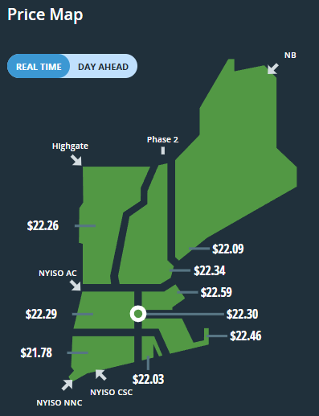

ARROW SEA 2025: Grid integration session
========================================

<!-- header: 'Intro & environment' -->

# Overview

1. Marginal pricing
2. Optimal power flow formulation
3. Congestion scenarios
4. Unit commitment

---

# Jupyter/Python notebook environment 

## Duplicate the ARROW SEA project in Deepnote

* Visit https://tinyurl.com/sea2025-deepnote
* Click on three dots `...` in the top-right corner
* Select `Duplicate project`
* Log in / Follow the prompts to create an account
* You can now edit a private copy of the project

---

<!-- header: '1. Marginal prices' -->

# Marginal prices 

## Objectives

Work through notebook `part1_mp` to:

* Review the graphical method of marginal pricing
* Reproduce this solution via linear programming

---

## (1a) Graphical approach to marginal pricing

1. Stack quantity-price offer pairs, ordered by price
2. Dispatch quantities to left of load
3. Intercept of load and offer price sets marginal price

> Does not apply to networks with limited transmission capacity

---

## (1b) Linear programming solution

* Study the [CVXPY](https://www.cvxpy.org/) formulation provided:
  1. Decision variables
  2. Constraints: power balance, bounds
  3. Objective function
* Verify that we reproduce the graphical solution

---

## Context: Locational Marginal Prices

---

<!-- header: '2. Optimal power flow' -->

# The Optimal Power Flow problem

## Objective

Work through Notebook `part2_opf`:
* Extend the LP formulation to account for transmission effects
  - Extra variables: line flows [MW], bus voltage angles [rad]
  - Extra constraint: Power flow on each line
  - Same objective function

---

## OPF problem formulation

| Name | Per   | Description         | Lower | Upper |
|-----|--------|---------------------|-------|-------|
| `p` | offers | dispatched power [MW] | 0 | offer quantity |
| `f` | lines  | line flow [MW]     | -(line capacity) | line capacity |
| `θ` | buses  | bus voltage angle [rad]    | $-\pi$ | $+\pi$ |

Power balance constraints:
$$
    \sum_{o \in \text{Offers @ $b$}} 
    \texttt{p}_o
    + \sum_{\ell \in \text{Lines in $b$}} \texttt{f}_\ell
    - \sum_{\ell \in \text{Lines out $b$}} \texttt{f}_\ell
    = \text{load}_b
    \quad \text{for each}~ b \in \text{Buses}
$$
Power flow constraints:
$$
\texttt{f}_{ij} = (\texttt{$θ$}_i - \texttt{$θ$}_j) / \texttt{reactance}_{ij}
   \quad \text{for each}~ (i,j) \in \text{Lines}
$$
One fixed voltage angle: $\theta_0 = 0$

---

## OPF problem formulation (cont.)

Objective:
$$
\text{total cost} = \min_{\texttt{p}, \texttt{f}, \theta}~ \sum_{o \in \text{Offers}} (\text{offer price})_o \times \texttt{p}_o
$$

Marginal price at bus $b$:
$$
\text{LMP}_b~[\$/\text{MWh}] = \frac{\partial~\text{total cost [\$/h]}}{\partial~\text{load}_b~[\text{MW}]}
$$ 

---

### AC optimal power flow (OPF) problem

The linearized OPF is an idealization of the AC problem:
$$
\begin{aligned}
\min_{S^{\text{gen}} \in \mathbb{C}^{M+N}, ~ v \in \mathbb{C}^M} ~ {}& \sum_a c_a(S_a^{\text{gen}})
\\
S_{bc} = {}& v_a (v_a^* - v_b^*) / z_{bc}^* \quad \text{(power flow on line $bc$)}
\\
S_a^{\text{gen}} = {}& \sum_{b} S_{bc} + S_a^{\text{load}} \quad \text{power balance at bus $b$}
\\
\vert S_{bc} \vert \leq {}& \bar{S}_{bc} \quad \text{line capacity}
\\
\underline{S}_b \leq {}& S_a^{\text{gen}} \leq \bar{S}_b \quad \text{injection limits}
\\
0 < \underline{v}_b \leq {}& |v_b| \leq \bar{v}_b \quad \text{voltage limits}
\\
v_0 = {}& 1 + 0i \quad \text{voltage at reference bus}
\end{aligned}
$$

---

| Symbol            | Linearized OPF | AC OPF analog                 | Assumption                              | Unit     |
| ----------------- | -------------- | ----------------------------- | --------------------------------------- | -------- |
| bus injection     | $\texttt{p}_b$          | $\operatorname{real}(S_{a}^{\text{gen}})$  | $\operatorname{imag}(S_{a}^{\text{gen}}) \approx 0$  | MW       |
| line flow         | $\texttt{f}_{bc}$       | $\operatorname{real}(S_{bc})$ | $\operatorname{imag}(S_{bc}) \approx 0$ | MW       |
| bus voltage angle | $\theta_b$     | $\operatorname{angle}(v_a)$   | $\operatorname{abs}(v_a) \approx 1$     | rad      |
| line reactance    | $x_{bc}$       | $\operatorname{imag}(z_{bc})$ | $\operatorname{real}(z_{bc}) \approx 0$ | $\Omega$ |

---

<!-- header: '3. Congestion' -->

# Congestion 

# Objective

Use the small 3-bus networks in Notebook `part3_congestion` to revisit two important observations:
1. Congestion causes LMP separation;
2. LMP separation is a price signal;

---

<!-- header: '4. Unit commitment' -->

# The Unit Commitment problem

## Context

OPF does not explicitly account for generator dynamics and fixed costs:

* Physical constraints:
  - on ramping
  - on allowable up-time / down-time
* Economic realities:
  - Fixed operating costs
  - Costs of start-up and shut-down

These are captured in **Unit Commitment** formulations run in the day-ahead market:

---

## Review: OPF Formulation

| Name | Per   | Description         | Lower | Upper |
|-----|--------|---------------------|-------|-------|
| `p` | offers | dispatched power [MW] | 0 | offer quantity |
| `f` | lines  | line flow [MW]     | -(line capacity) | line capacity |
| `θ` | buses  | bus voltage angle [rad]    | $-\pi$ | $+\pi$ |

Constraints
* Power balance at each bus
* Power flow on each line
* Fixed voltage angle at reference bus

---

## Unit commitment (UC) formulation

### Data

* OPF data +
* Load forcast for **each** bus, **each** period

### Decision variables

* OPF variables for **each** planning period
* Extra **binary** variables for each generator and **each** period

| Description | Name | Costs | Constraints |
|-------------|------|-------|-------------|
| commitment variable | `x_on` | fixed |  (logical)  | 
| start-up variable | `x_su` | start-up | minimum up-time  |
| shut-down variable | `x_sd` | shut-down | minimum down-time |

---

### Objective function

| Cost | Dependence | Unit |
|---|---|---|
| energy | output | $/MWh |
| operating ("no-load") | on/off | $/h |
| start-up, shut-down | transition | $ |

Objective: Total cost to be minimized over planning horizon
$$
\begin{aligned}
  \sum_t \left(
    \sum_o \texttt{offer\_price}_{o} \, p_{o,t}
  + \sum_g
    \texttt{noload\_cost}_{g}   \, \texttt{x\_on}_{g, t}
  + \texttt{startup\_cost}_{g}  \, \texttt{x\_su}_{g, t}
  + \texttt{shutdown\_cost}_{g} \, \texttt{x\_sd}_{g, t}
  \right)
\end{aligned}
$$

---

## Unit commitment (UC) formulation (cont.)

Constraints: 

* OPF-style constraints at **each period**:
  - Power balance at each bus
  - Power flow on each line
  - Fixed voltage angle at reference bus

* Dynamic constraints: for each generator $g$ at time $t$
$$
\begin{aligned}
  \vert p_{g, t} - p_{g, t - 1} \vert \leq {}& \texttt{max\_ramp}_g
  \\
  \texttt{x\_on}_{g, t + \tau} \geq {}& \texttt{x\_su}_{g, t} \quad \text{for each}~ \tau \in [0, \texttt{min\_uptime}_g]
  \\
  \texttt{x\_on}_{g, t + \tau} \leq {}& 1 - \texttt{x\_sd}_{g, t} \quad \text{for each}~ \tau \in [0, \texttt{min\_downtime}_g]
\end{aligned}
$$

---

<!-- header: 'Review quiz' -->

# Review questions

## Marginal prices

1. Identify products with near-zero marginal price?
2. What is a (locational) marginal energy price (LMP)?
3. Why might LMPs vary across a network?
4. Why do LMPs vary over time?
5. How are LMPs used to settle energy transactions?
6. (How are they settled in New England?)
5. Which operating costs are not captured by marginal pricing?
6. How are these additional costs covered in practice?

---

## Optimal power flow

1. What are the decision variables of the OPF problem?
2. What are the constraints?
3. What is the objective function?
4. What are the key assumptions in the linearized OPF model?
5. Are we always able to solve the linearized OPF?
6. Why not solve the AC-OPF instead?
8. Why is it necessary to prescribe the voltage angle at one bus?

---

### Unit commitment

Contrast the following elements of the UC and OPF problems:
1. Decision variables
2. Constraints
3. Objective function
3. Why do fixed costs difficult to reconcile with marginal prices?

## Network economics

1. Do the LMP have economic significance at a bus with zero load? With zero generation capacity?
2. How can load payments exceed generation payments if energy losses are neglected?

---

<!-- header: 'Further reading' -->

# Further reading

* [Fu & Li (2006) _Different Models and properties on LMP calculations_](https://doi.org/10.1109/PES.2006.1709536)
  - A description of LMP formulations, including the pricing of congestion and losses
* [Krishnamurthy, Li, & Tesfatsion (2016) _An 8-Zone Test System Based on ISO New England Data: Development and Application_](https://doi.org/10.1109/TPWRS.2015.2399171)
  - Description of the ISO-NE 8-bus model
* [Li & Bo (2010) _Small Test Systems for Power System Economic Studies_](https://doi.org/10.1109/PES.2010.5589973)
  - A description of the PJM 5-bus model
* [Gribik, Hogan, & Pope (2007) _Market-Clearing Electricity Prices and Energy Uplift_](https://hepg.hks.harvard.edu/publications/market-clearing-electricity-prices-and-energy-uplift)
  - Explains the difficulty of compensating for fixed costs
 
<!-- header: 
* [CVXPY documentation](https://www.cvxpy.org/)
* [Deepnote documentation](https://deepnote.com/docs/)
* [Jupyter documentation](https://docs.jupyter.org/en/latest/)
-->

_Thanks for your time and participation!_
